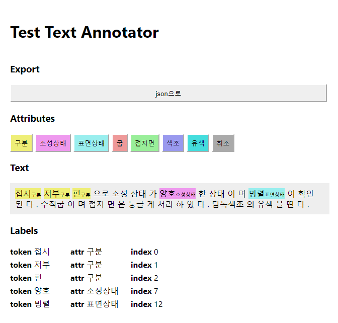
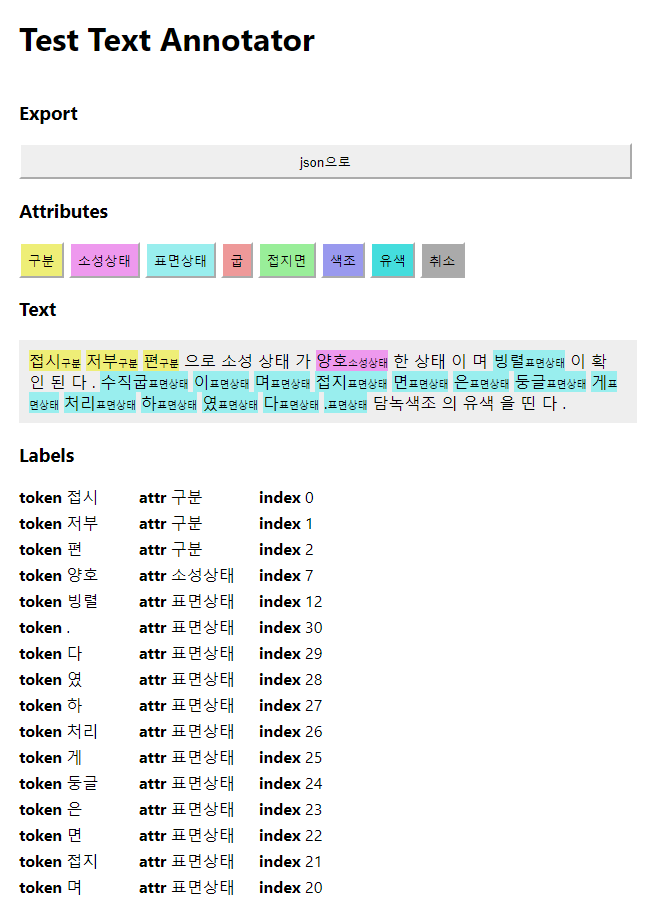
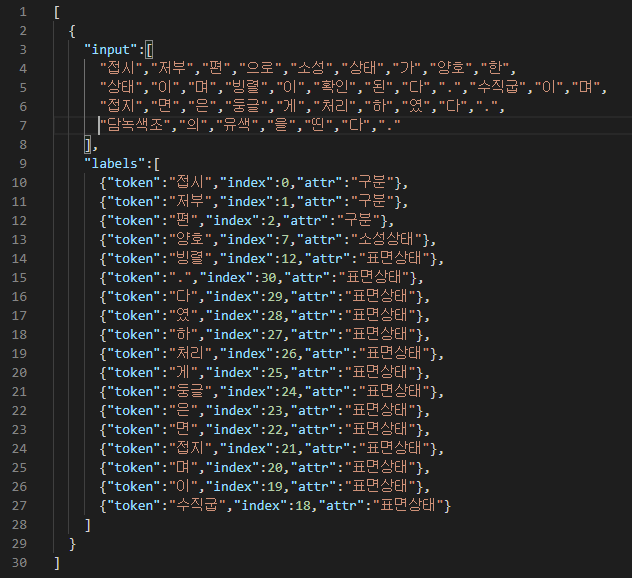

## Test Text Annotator
텍스트 어노테이션을 위한 간단한 데모 페이지입니다. 여러 문장에서 특정 속성들을 골라 내는 과정에는 tokenizing도 포함되어 있지만, 이 데모 페이지에서는 tokenizing은 이미 구현이 되어 있고, 주어진 토큰들 중 특정 속성들을 나타내는 토큰들을 골라 내는 작업을 위한 어노테이션을 목표로 하고 있습니다. 

### 지원 브라우저
- Internet Explorer를 제외한 거의 모든 브라우저를 지원할 것으로 예상

### 테스트 방법
- git clone https://github.com/batoners/text-annotation-demo.git
- cd text-annotation-demo
- npm install
- npm start

### 파일 설명
- App.js: 리액트 프로젝트의 최상위 컴포넌트라고 볼 수 있습니다. 개발자 도구 (크롬의 경우 F12) 에서 HTML 구조를 볼 때, body 태그의 "root"이라는 id를 가지는 div 태그에 들어갈 컴포넌트를 이 파일에서 정합니다. 이번 프로젝트의 경우, 직접 만든 Annotator 컴포넌트를 렌더링 하도록 하였습니다. 또한, 예시 데이터를 이 파일에서 선언하였습니다. 
- Annotator.js: Components/Annotator 디렉토리에 구현되어 있으며, 이 데모 페이지의 핵심이 담겨 있는 컴포넌트입니다. 속성 목록, 토큰 목록을 받으며, 데모 페이지의 경우 특별히 미리 설정된 라벨 목록도 받을 수 있도록 하였습니다.

### 사용 방법
- 어노테이션 하고 싶은 토큰 위로 마우스를 가져갑니다. 마우스 모양이 포인터 모양으로 변합니다.
- 토큰을 클릭하면 해당 토큰은 굵게 표시될 것입니다.
- 다른 토큰을 클릭하면 그 토큰도 굵게 표시될 것입니다.
- 여러 토큰을 선택한 후, 상단의 속성 버튼 중 하나를 클릭합니다.
- 그러면, 선택된 토큰들은 해당 속성을 가지게 되고, Text 섹션과 Labels 섹션에 변화가 생길 것입니다.

- 이미 속성을 가지고 있는 토큰을 선택하고 다른 속성을 선택하게 되면 원래 속성은 사라집니다. (데모 페이지기 때문에, 개발의 용이함을 위해 한 토큰이 하나의 속성만 가질 수 있도록 하였습니다.)
- 취소 속성을 클릭할 경우, 해당 토큰들은 가지고 있던 속성들을 잃게 됩니다.
- 상단의 "json으로" 버튼을 클릭할 경우, json 형태의 간이 말뭉치 파일을 받게 됩니다.

